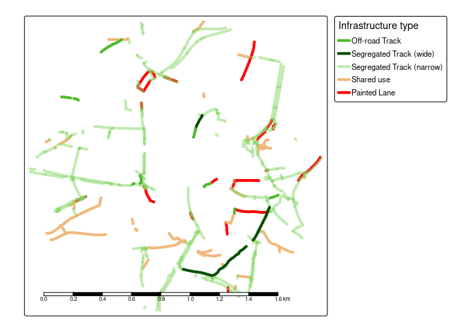
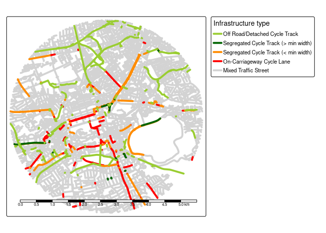

<!-- README.md is generated from README.Rmd. Please edit that file -->

# osmactive

<!-- badges: start -->
<!-- badges: end -->

The goal of osmactive is to provide functions, example datasets and
documentation for extracting active travel infrastructure from
OpenStreetMap data.

Install the package with:

``` r
remotes::install_github("nptscot/osmactive")
library(osmactive)
```

## Leeds example

``` r
library(dplyr)
#> 
#> Attaching package: 'dplyr'
#> The following objects are masked from 'package:stats':
#> 
#>     filter, lag
#> The following objects are masked from 'package:base':
#> 
#>     intersect, setdiff, setequal, union
library(tmap)
#> 
#> Attaching package: 'tmap'
#> The following object is masked from 'package:datasets':
#> 
#>     rivers
leeds = zonebuilder::zb_zone("Leeds")
leeds = leeds |>
  filter(circle_id == 1)
osm = get_travel_network("Leeds", boundary = leeds, boundary_type = "clipsrc")
#> No exact match found for place = Leeds and provider = geofabrik. Best match is Laos. 
#> Checking the other providers.
#> An exact string match was found using provider = bbbike.
#> The chosen file was already detected in the download directory. Skip downloading.
#> Starting with the vectortranslate operations on the input file!
#> 0...10...20...30...40...50...60...70...80...90...100 - done.
#> Warning in CPL_gdalvectortranslate(source, destination, options, oo, doo, :
#> GDAL Message 1: A geometry of type MULTILINESTRING is inserted into layer lines
#> of geometry type LINESTRING, which is not normally allowed by the GeoPackage
#> specification, but the driver will however do it. To create a conformant
#> GeoPackage, if using ogr2ogr, the -nlt option can be used to override the layer
#> geometry type. This warning will no longer be emitted for this combination of
#> layer and feature geometry type.
#> Finished the vectortranslate operations on the input file!
#> Reading layer `lines' from data source `/home/robin/data/osm/bbbike_Leeds.gpkg' using driver `GPKG'
#> Simple feature collection with 4163 features and 31 fields
#> Geometry type: MULTILINESTRING
#> Dimension:     XY
#> Bounding box:  xmin: -1.558963 ymin: 53.78843 xmax: -1.528622 ymax: 53.80639
#> Geodetic CRS:  WGS 84
cycle_network = get_cycling_network(osm)
driving_network = get_driving_network_major(osm)
cycle_network_with_distance = distance_to_road(cycle_network, driving_network)
#> Warning: st_point_on_surface assumes attributes are constant over geometries
#> Warning in st_point_on_surface.sfc(st_geometry(x)): st_point_on_surface may not
#> give correct results for longitude/latitude data
cycle_network_classified = classify_cycleways(cycle_network_with_distance)
m = cycle_network_classified |>
  arrange(desc(cycle_segregation)) |>
  tm_shape() + tm_lines("cycle_segregation", lwd = 4, palette = "-PuBuGn", popup.vars = c("name", "cycle_segregation", "distance_to_road", "maxspeed", "highway", "other_tags"), plot.order = tm_plot_order("DATA"))
#> tm_lines: Deprecated tmap v3 code detected. Code translated to v4
m
```

<!-- -->

``` r
tmap_save(m, "classify_cycleways_leeds.html")
browseURL("classify_cycleways_leeds.html")
```

## Edinburgh example

``` r
edinburgh = zonebuilder::zb_zone("Edinburgh")
edinburgh_1km = edinburgh |>
  # Change number in next line to change zone size:
  filter(circle_id <= 1)
osm = get_travel_network("Scotland")
#> The input place was matched with: Scotland
#> The chosen file was already detected in the download directory. Skip downloading.
#> The corresponding gpkg file was already detected. Skip vectortranslate operations.
#> Reading layer `lines' from data source 
#>   `/home/robin/data/osm/geofabrik_scotland-latest.gpkg' using driver `GPKG'
#> Simple feature collection with 1388227 features and 31 fields
#> Geometry type: LINESTRING
#> Dimension:     XY
#> Bounding box:  xmin: -20.62345 ymin: 52.69143 xmax: 9.975589 ymax: 65.36242
#> Geodetic CRS:  WGS 84
cycle_network = get_cycling_network(osm)
driving_network = get_driving_network(osm)
edinburgh_cycle = cycle_network[edinburgh_1km, , op = sf::st_within]
edinburgh_driving = driving_network[edinburgh_1km, , op = sf::st_within]
edinburgh_cycle_with_distance = distance_to_road(edinburgh_cycle, edinburgh_driving)
#> Warning: st_point_on_surface assumes attributes are constant over geometries
#> Warning in st_point_on_surface.sfc(st_geometry(x)): st_point_on_surface may not
#> give correct results for longitude/latitude data
edinburgh_segregated = classify_cycleways(edinburgh_cycle_with_distance)
table(edinburgh_segregated$cycle_segregation)
#> 
#>        offroad_track roadside_cycle_track        mixed_traffic 
#>                    6                   87                  863
m = edinburgh_segregated |>
  arrange(cycle_segregation) |>
  tm_shape() + tm_lines("cycle_segregation", lwd = 4, palette = "-Blues", popup.vars = c("name", "cycle_segregation", "distance_to_road", "maxspeed", "highway", "other_tags"))
#> tm_lines: Deprecated tmap v3 code detected. Code translated to v4
m
```

<!-- -->

``` r
# tmap_save(m, "classify_cycleways_edinburgh.html")
```

Save an interactive version of the map to check the results as follows:

``` r
tmap_save(m, "classify_cycleways_edinburgh.html")
browseURL("classify_cycleways_edinburgh.html")
```

## Lisbon example

``` r
lisbon = zonebuilder::zb_zone("Lisbon")
lisbon = sf::st_sf(
  lisbon |> sf::st_drop_geometry() |> select(-centroid),
  geometry = sf::st_geometry(lisbon)
)
lisbon = lisbon |>
  filter(circle_id == 1)
u = "https://github.com/U-Shift/SiteSelection/releases/download/0.1/CAOP_municipios.gpkg"
f = basename(f)
if (!file.exists(f)) download.file(u, f)
PTcities = sf::read_sf(f) # Portugal
lisbon = PTcities |> filter(Concelho == "Lisboa")
lisbon = lisbon |>
  sf::st_convex_hull()
f = list.files("~/data/osm", pattern = "portugal*.+pbf", full.names = TRUE)
osm = sf::read_sf(f, query = "select * from lines where highway is not null")
osm = get_travel_network("Portugal", boundary = lisbon, boundary_type = "clipsrc", force_vectortranslate = TRUE)
list.files("~/data/osm", pattern = "portugal")
cycle_network = get_cycling_network(osm)
driving_network = get_driving_network(osm)
cycle_network_with_distance = distance_to_road(cycle_network, driving_network)
lisbon_categorized = classify_cycleways(cycle_network_with_distance)
m = lisbon_categorized |>
  arrange(cycle_segregation) |>
  tm_shape() + tm_lines("cycle_segregation", lwd = 4, palette = "-Blues", popup.vars = c("name", "cycle_segregation", "distance_to_road", "maxspeed", "highway", "other_tags"))
m
```

``` r
tmap_save(m, "classify_cycleways_lisbon.html")
browseURL("classify_cycleways_lisbon.html")
```
