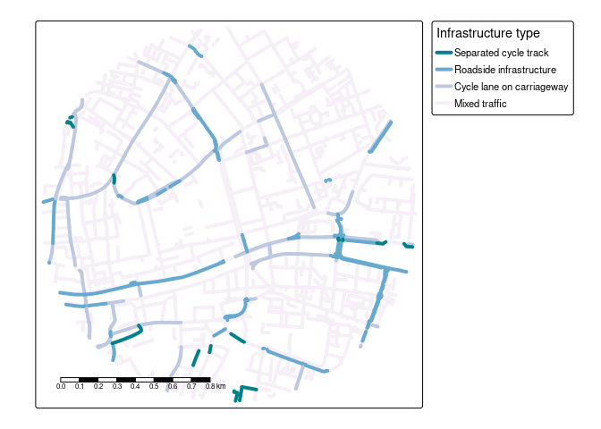

<!-- README.md is generated from README.Rmd. Please edit that file -->

# osmactive

<!-- badges: start -->

[](https://github.com/nptscot/osmactive/actions/workflows/R-CMD-check.yaml)

<!-- badges: end -->

The goal of osmactive is to provide functions, example datasets and
documentation for extracting active travel infrastructure from
OpenStreetMap data.

Install the package with:

``` r
remotes::install_github("nptscot/osmactive")
library(osmactive)
```

## Leeds example

``` r
library(dplyr)
library(tmap)
leeds_zb = zonebuilder::zb_zone("Leeds")
leeds = leeds_zb |>
  filter(circle_id == 1)
osm = get_travel_network("Leeds", boundary = leeds, boundary_type = "clipsrc")
#> 0...10...20...30...40...50...60...70...80...90...100 - done.
#> Reading layer `lines' from data source `/home/robin/data/osm/bbbike_Leeds.gpkg' using driver `GPKG'
#> Simple feature collection with 4163 features and 31 fields
#> Geometry type: MULTILINESTRING
#> Dimension:     XY
#> Bounding box:  xmin: -1.558963 ymin: 53.78843 xmax: -1.528622 ymax: 53.80639
#> Geodetic CRS:  WGS 84
cycle_net = get_cycling_network(osm)
drive_net = get_driving_network_major(osm)
cycle_net = distance_to_road(cycle_net, drive_net)
cycle_net = classify_cycle_infrastructure(cycle_net)
m = plot_osm_tmap(cycle_net)
m
```

<!-- -->

## Edinburgh example

``` r
edinburgh = zonebuilder::zb_zone("Edinburgh")
edinburgh_3km = edinburgh |>
  # Change number in next line to change zone size:
  filter(circle_id <= 2) |>
  sf::st_union()
osm = get_travel_network("Scotland", boundary = edinburgh_3km, boundary_type = "clipsrc")
#> 0...10...20...30...40...50...60...70...80...90...100 - done.
#> Reading layer `lines' from data source 
#>   `/home/robin/data/osm/geofabrik_scotland-latest.gpkg' using driver `GPKG'
#> Simple feature collection with 44341 features and 31 fields
#> Geometry type: MULTILINESTRING
#> Dimension:     XY
#> Bounding box:  xmin: -3.236391 ymin: 55.9264 xmax: -3.140354 ymax: 55.98029
#> Geodetic CRS:  WGS 84
cycle_net = get_cycling_network(osm)
drive_net = get_driving_network_major(osm)
cycle_net = distance_to_road(cycle_net, drive_net)
cycle_net = classify_cycle_infrastructure(cycle_net)
m = plot_osm_tmap(cycle_net)
m
```

<!-- -->

Save an interactive version of the map to check the results as follows:

## Dublin example

``` r
dublin_zones = zonebuilder::zb_zone("Dublin")
dublin = dublin_zones |>
  filter(circle_id == 1)
osm = get_travel_network("Republic of Ireland", boundary = dublin, boundary_type = "clipsrc")
#> 0...10...20...30...40...50...60...70...80...90...100 - done.
#> Reading layer `lines' from data source 
#>   `/home/robin/data/osm/geofabrik_ireland-and-northern-ireland-latest.gpkg' 
#>   using driver `GPKG'
#> Simple feature collection with 3723 features and 31 fields
#> Geometry type: MULTILINESTRING
#> Dimension:     XY
#> Bounding box:  xmin: -6.275573 ymin: 53.3404 xmax: -6.245544 ymax: 53.35836
#> Geodetic CRS:  WGS 84
cycle_net = get_cycling_network(osm)
drive_net = get_driving_network_major(osm)
cycle_net = distance_to_road(cycle_net, drive_net)
cycle_net = classify_cycle_infrastructure(cycle_net)
m = plot_osm_tmap(cycle_net)
m
```

<!-- -->

## Lisbon example

``` r
lisbon = zonebuilder::zb_zone("Lisbon")
lisbon = sf::st_sf(
  lisbon |> sf::st_drop_geometry() |> select(-centroid),
  geometry = sf::st_geometry(lisbon)
)
lisbon = lisbon |>
  filter(circle_id == 1)
u = "https://github.com/U-Shift/SiteSelection/releases/download/0.1/CAOP_municipios.gpkg"
f = basename(f)
if (!file.exists(f)) download.file(u, f)
PTcities = sf::read_sf(f) # Portugal
lisbon = PTcities |> filter(Concelho == "Lisboa")
lisbon = lisbon |>
  sf::st_convex_hull()
f = list.files("~/data/osm", pattern = "portugal*.+pbf", full.names = TRUE)
osm = sf::read_sf(f, query = "select * from lines where highway is not null")
osm = get_travel_network("Portugal", boundary = lisbon, boundary_type = "clipsrc", force_vectortranslate = TRUE)
list.files("~/data/osm", pattern = "portugal")
cycle_net = get_cycling_network(osm)
drive_net = get_drive_net_major(osm)
cycle_net = distance_to_road(cycle_net, drive_net)
lisbon_categorized = classify_cycle_infrastructure(cycle_net)
m = plot_osm_tmap(lisbon_categorized)
m
```

``` r
tmap_save(m, "classify_cycle_infrastructure_lisbon.html")
browseURL("classify_cycle_infrastructure_lisbon.html")
```
