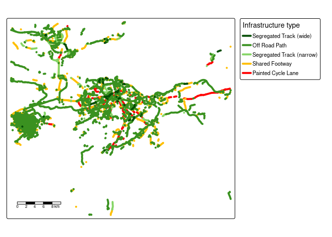
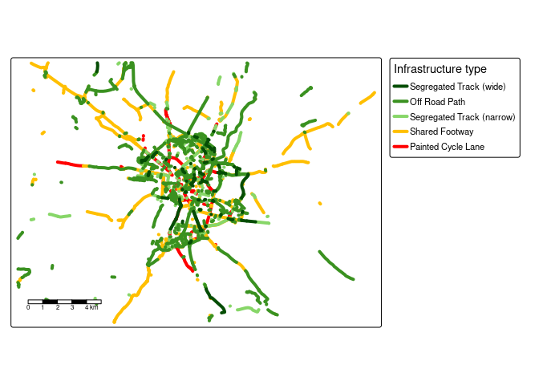

<!-- README.md is generated from README.Rmd. Please edit that file -->

# osmactive

<!-- badges: start -->

[](https://github.com/nptscot/osmactive/actions/workflows/R-CMD-check.yaml)

<!-- badges: end -->

The goal of osmactive is to provide functions, example datasets and
documentation for extracting active travel infrastructure from
OpenStreetMap data.

Install the package with:

``` r
remotes::install_github("nptscot/osmactive")
```

``` r
library(osmactive)
library(tmap) # for mapping
library(dplyr) # for data manipulation
library(sf) # for spatial data
```

Alternatively, you can load the package with the following for local
development:

``` r
devtools::load_all()
```

## Minimal example

The package comes with example data for testing functions. You can test
the functions as follows:

``` r
osm = osm_edinburgh
cycle_net = get_cycling_network(osm)
drive_net = get_driving_network(osm)
drive_net_major = get_driving_network(osm)
cycle_net = distance_to_road(cycle_net, drive_net)
cycle_net = classify_cycle_infrastructure(cycle_net)
table(cycle_net$detailed_segregation)
#> 
#>          Level track Mixed Traffic Street    Off Road Cycleway 
#>                   16                    1                    1 
#>   Painted Cycle Lane 
#>                    3
table(cycle_net$cycle_segregation)
#> 
#>   Segregated Track (wide)         Off Road Cycleway Segregated Track (narrow) 
#>                         7                         1                         7 
#>            Shared Footway        Painted Cycle Lane 
#>                         3                         3
```

You can also create plots with the packaged `plot_osm_tmap()` function:

``` r
m = plot_osm_tmap(cycle_net)
m
```

<!-- -->

Estimate the ‘level of service’ of cycle infrastructure:

``` r
cycle_net_los = level_of_service(cycle_net)
table(cycle_net_los$`Level of Service`)
#> 
#>                                            High 
#>                                              10 
#>                                          Medium 
#>                                              11 
#>                                             Low 
#>                                               0 
#>              Should not be used (mixed traffic) 
#>                                               0 
#> Should not be used (non-compliant intervention) 
#>                                               0
plot(cycle_net_los["Level of Service"])
```

<!-- -->

## Leeds example

``` r
osm = get_travel_network("Leeds")
#> Reading layer `lines' from data source `/data/bronze/osm/bbbike_Leeds.gpkg' using driver `GPKG'
#> Simple feature collection with 175051 features and 67 fields
#> Geometry type: LINESTRING
#> Dimension:     XY
#> Bounding box:  xmin: -1.889999 ymin: 53.65 xmax: -1.280002 ymax: 53.88
#> Geodetic CRS:  WGS 84
cycle_net = get_cycling_network(osm)
drive_net = get_driving_network(osm)
cycle_net_d = distance_to_road(cycle_net, drive_net)
cycle_net_c = classify_cycle_infrastructure(cycle_net_d)
m = plot_osm_tmap(cycle_net_c)
m
```

<!-- -->

## Edinburgh example

``` r
osm = get_travel_network("Edinburgh")
#> Reading layer `lines' from data source `/data/bronze/osm/bbbike_Edinburgh.gpkg' using driver `GPKG'
#> Simple feature collection with 225097 features and 67 fields
#> Geometry type: LINESTRING
#> Dimension:     XY
#> Bounding box:  xmin: -3.579998 ymin: 55.7 xmax: -2.77 ymax: 56.1
#> Geodetic CRS:  WGS 84
cycle_net = get_cycling_network(osm)
drive_net = get_driving_network(osm)
cycle_net = distance_to_road(cycle_net, drive_net)
cycle_net = classify_cycle_infrastructure(cycle_net)
m = plot_osm_tmap(cycle_net)
m
```

<!-- -->

<!-- Save an interactive version of the map to check the resu lts as follows: -->

## Dublin example

``` r
dublin_zones = zonebuilder::zb_zone("Dublin")
dublin_6km = dublin_zones |>
  filter(circle_id <= 3) |>
  sf::st_union()
osm = get_travel_network("Republic of Ireland", boundary = dublin_6km, boundary_type = "clipsrc")
#> 0...10...20...30...40...50...60...70..
#> .80...90...100 - done.
#> Reading layer `lines' from data source 
#>   `/data/bronze/osm/geofabrik_ireland-and-northern-ireland-latest.gpkg' 
#>   using driver `GPKG'
#> Simple feature collection with 54740 features and 67 fields
#> Geometry type: MULTILINESTRING
#> Dimension:     XY
#> Bounding box:  xmin: -6.350653 ymin: 53.29547 xmax: -6.170875 ymax: 53.40329
#> Geodetic CRS:  WGS 84
cycle_net = get_cycling_network(osm)
drive_net = get_driving_network(osm)
cycle_net = distance_to_road(cycle_net, drive_net)
cycle_net = classify_cycle_infrastructure(cycle_net)
m = plot_osm_tmap(cycle_net)
m
```

<!-- -->

## Lisbon example

``` r
u = "https://ushift.tecnico.ulisboa.pt/content/data/lisbon_limit.geojson"
f = basename(u)
if (!file.exists(f)) download.file(u, f)
lisbon = sf::read_sf(f)
lisbon = lisbon |>
  sf::st_cast("POLYGON")
osm = get_travel_network("Portugal", boundary = lisbon, boundary_type = "clipsrc", force_vectortranslate = TRUE)
#> 0...10...20...30...40...50...60...70..
#> .80...90...100 - done.
#> Reading layer `lines' from data source 
#>   `/data/bronze/osm/geofabrik_portugal-latest.gpkg' using driver `GPKG'
#> Simple feature collection with 53724 features and 67 fields
#> Geometry type: MULTILINESTRING
#> Dimension:     XY
#> Bounding box:  xmin: -9.229835 ymin: 38.6914 xmax: -9.087336 ymax: 38.79747
#> Geodetic CRS:  WGS 84
cycle_net = get_cycling_network(osm)
drive_net = get_driving_network(osm)
cycle_net = distance_to_road(cycle_net, drive_net)
cycle_net = classify_cycle_infrastructure(cycle_net)
m = plot_osm_tmap(cycle_net)
m
```

<!-- -->

## London

``` r
london = zonebuilder::zb_zone("Southwark Station", n_circles = 1)
london = sf::st_union(london) |>
  sf::st_make_valid()
osm = get_travel_network(london, boundary = london, boundary_type = "clipsrc")
#> 0...10...20...30...40...50...60...70...80...90..
#> .100 - done.
#> Reading layer `lines' from data source 
#>   `/data/bronze/osm/geofabrik_greater-london-latest.gpkg' using driver `GPKG'
#> Simple feature collection with 6110 features and 67 fields
#> Geometry type: MULTILINESTRING
#> Dimension:     XY
#> Bounding box:  xmin: -0.1191413 ymin: 51.49491 xmax: -0.09034955 ymax: 51.51288
#> Geodetic CRS:  WGS 84
cycle_net = get_cycling_network(osm)
drive_net = get_driving_network(osm)
cycle_net = distance_to_road(cycle_net, drive_net)
cycle_net = classify_cycle_infrastructure(cycle_net)
m = plot_osm_tmap(cycle_net)
m
```

<!-- -->

## Cambridge

``` r
cambridge = zonebuilder::zb_zone("Cambridge")
cambridge = sf::st_union(cambridge) |>
  sf::st_make_valid()
osm = get_travel_network("Cambridge", boundary = cambridge, boundary_type = "clipsrc")
#> 0...10...20...30...40...50...60...70...80...90...100 - done.
#> Reading layer `lines' from data source `/data/bronze/osm/bbbike_Cambridge.gpkg' using driver `GPKG'
#> Simple feature collection with 50436 features and 67 fields
#> Geometry type: MULTILINESTRING
#> Dimension:     XY
#> Bounding box:  xmin: -0.0399984 ymin: 52.12 xmax: 0.319972 ymax: 52.28
#> Geodetic CRS:  WGS 84
cycle_net = get_cycling_network(osm)
drive_net = get_driving_network(osm)
cycle_net = distance_to_road(cycle_net, drive_net)
cycle_net = classify_cycle_infrastructure(cycle_net)
m = plot_osm_tmap(cycle_net)
m
```

<!-- -->

## Bristol example

``` r
osm = get_travel_network("Edinburgh")
#> Reading layer `lines' from data source `/data/bronze/osm/bbbike_Edinburgh.gpkg' using driver `GPKG'
#> Simple feature collection with 225097 features and 67 fields
#> Geometry type: LINESTRING
#> Dimension:     XY
#> Bounding box:  xmin: -3.579998 ymin: 55.7 xmax: -2.77 ymax: 56.1
#> Geodetic CRS:  WGS 84
cycle_net = get_cycling_network(osm)
drive_net = get_driving_network(osm)
cycle_net = distance_to_road(cycle_net, drive_net)
cycle_net = classify_cycle_infrastructure(cycle_net)
m = plot_osm_tmap(cycle_net)
m
```

<!-- -->

<!-- Save an interactive version of the map to check the resu lts as follows: -->
