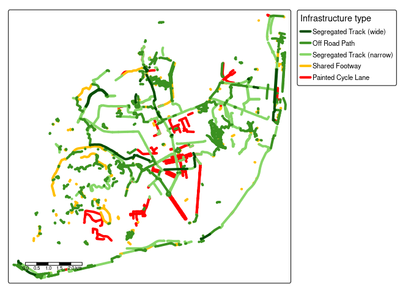

<!-- README.md is generated from README.Rmd. Please edit that file -->

# osmactive

<!-- badges: start -->

[](https://github.com/nptscot/osmactive/actions/workflows/R-CMD-check.yaml)

<!-- badges: end -->

The goal of osmactive is to provide functions, example datasets and
documentation for extracting active travel infrastructure from
OpenStreetMap data.

Install the package with:

``` r
remotes::install_github("nptscot/osmactive")
```

``` r
library(osmactive)
library(tmap) # for mapping
library(dplyr) # for data manipulation
library(sf) # for spatial data
```

Alternatively, you can load the package with the following for local
development:

## Minimal example

The package comes with example data for testing functions. You can test
the functions as follows:

``` r
osm = osm_edinburgh
cycle_net = get_cycling_network(osm)
drive_net = get_driving_network(osm)
drive_net_major = get_driving_network(osm)
cycle_net = distance_to_road(cycle_net, drive_net)
cycle_net = classify_cycle_infrastructure(cycle_net)
table(cycle_net$detailed_segregation)
table(cycle_net$cycle_segregation)
```

You can also create plots with the packaged `plot_osm_tmap()` function:

``` r
m = plot_osm_tmap(cycle_net)
m
```

<!-- -->

## Leeds example

``` r
leeds_6km = leeds_zb |>
  filter(circle_id <= 3) |>
  sf::st_union()
osm = get_travel_network("Leeds", boundary = leeds_6km, boundary_type = "clipsrc")
#> 0...10...20...30...40...50...60...70...80...90...100 - done.
#> Reading layer `lines' from data source `/home/robin/data/osm/bbbike_Leeds.gpkg' using driver `GPKG'
#> Simple feature collection with 39330 features and 42 fields
#> Geometry type: MULTILINESTRING
#> Dimension:     XY
#> Bounding box:  xmin: -1.634843 ymin: 53.74351 xmax: -1.452746 ymax: 53.85133
#> Geodetic CRS:  WGS 84
cycle_net = get_cycling_network(osm)
drive_net = get_driving_network(osm)
cycle_net = distance_to_road(cycle_net, drive_net)
cycle_net = classify_cycle_infrastructure(cycle_net)
m = plot_osm_tmap(cycle_net)
m
```

<!-- -->

``` r
tmap_save(m, "classify_cycle_infrastructure_leeds.html")
browseURL("classify_cycle_infrastructure_leeds.html")

system("gh release upload v0.1 classify_cycle_infrastructure_leeds.html --clobber")

# Available:
# https://github.com/nptscot/osmactive/releases/download/v0.1/classify_cycle_infrastructure_leeds.html
```

## Edinburgh example

``` r
edinburgh = zonebuilder::zb_zone("Edinburgh")
edinburgh_3km = edinburgh |>
  # Change number in next line to change zone size:
  filter(circle_id <= 2) |>
  sf::st_union()
osm = get_travel_network("Scotland", boundary = edinburgh_3km, boundary_type = "clipsrc")
#> 0...10...20...30...40...50...60...70...80.
#> ..90...100 - done.
#> Reading layer `lines' from data source 
#>   `/home/robin/data/osm/geofabrik_scotland-latest.gpkg' using driver `GPKG'
#> Simple feature collection with 44341 features and 42 fields
#> Geometry type: MULTILINESTRING
#> Dimension:     XY
#> Bounding box:  xmin: -3.236391 ymin: 55.9264 xmax: -3.140354 ymax: 55.98029
#> Geodetic CRS:  WGS 84
cycle_net = get_cycling_network(osm)
drive_net = get_driving_network(osm)
cycle_net = distance_to_road(cycle_net, drive_net)
cycle_net = classify_cycle_infrastructure(cycle_net)
m = plot_osm_tmap(cycle_net)
m
```

<!-- -->

<!-- Save an interactive version of the map to check the results as follows: -->

## Dublin example

``` r
dublin_6km = dublin_zones |>
  filter(circle_id <= 3) |>
  sf::st_union()
osm = get_travel_network("Republic of Ireland", boundary = dublin_6km, boundary_type = "clipsrc")
#> 0...10...20...30...40...50...60...
#> 70...80...90...100 - done.
#> Reading layer `lines' from data source 
#>   `/home/robin/data/osm/geofabrik_ireland-and-northern-ireland-latest.gpkg' 
#>   using driver `GPKG'
#> Simple feature collection with 50319 features and 42 fields
#> Geometry type: MULTILINESTRING
#> Dimension:     XY
#> Bounding box:  xmin: -6.350653 ymin: 53.29547 xmax: -6.170875 ymax: 53.40329
#> Geodetic CRS:  WGS 84
cycle_net = get_cycling_network(osm)
drive_net = get_driving_network(osm)
cycle_net = distance_to_road(cycle_net, drive_net)
cycle_net = classify_cycle_infrastructure(cycle_net)
m = plot_osm_tmap(cycle_net)
m
```

<!-- -->

## Lisbon example

``` r
u = "https://ushift.tecnico.ulisboa.pt/content/data/lisbon_limit.geojson"
f = basename(u)
if (!file.exists(f)) download.file(u, f)
lisbon = sf::read_sf(f)
lisbon = lisbon |>
  sf::st_cast("POLYGON")
osm = get_travel_network("Portugal", boundary = lisbon, boundary_type = "clipsrc", force_vectortranslate = TRUE)
#> 0...10...20...30...40...50...60...70...
#> 80...90...100 - done.
#> Reading layer `lines' from data source 
#>   `/home/robin/data/osm/geofabrik_portugal-latest.gpkg' using driver `GPKG'
#> Simple feature collection with 47866 features and 42 fields
#> Geometry type: MULTILINESTRING
#> Dimension:     XY
#> Bounding box:  xmin: -9.229835 ymin: 38.6914 xmax: -9.087336 ymax: 38.79747
#> Geodetic CRS:  WGS 84
cycle_net = get_cycling_network(osm)
drive_net = get_driving_network(osm)
cycle_net = distance_to_road(cycle_net, drive_net)
cycle_net = classify_cycle_infrastructure(cycle_net)
m = plot_osm_tmap(cycle_net)
m
```

<!-- -->

## London

``` r
london = zonebuilder::zb_zone("Southwark Station", n_circles = 1)
london = sf::st_union(london) |>
  sf::st_make_valid()
osm = get_travel_network(london, boundary = london, boundary_type = "clipsrc")
#> 0...10...20...30...40...50...60...70...80...90...100 - done.
#> Reading layer `lines' from data source 
#>   `/home/robin/data/osm/geofabrik_greater-london-latest.gpkg' 
#>   using driver `GPKG'
#> Simple feature collection with 6168 features and 42 fields
#> Geometry type: MULTILINESTRING
#> Dimension:     XY
#> Bounding box:  xmin: -0.1189676 ymin: 51.4957 xmax: -0.09016682 ymax: 51.51368
#> Geodetic CRS:  WGS 84
cycle_net = get_cycling_network(osm)
drive_net = get_driving_network(osm)
cycle_net = distance_to_road(cycle_net, drive_net)
cycle_net = classify_cycle_infrastructure(cycle_net)
m = plot_osm_tmap(cycle_net)
m
```

<!-- -->
