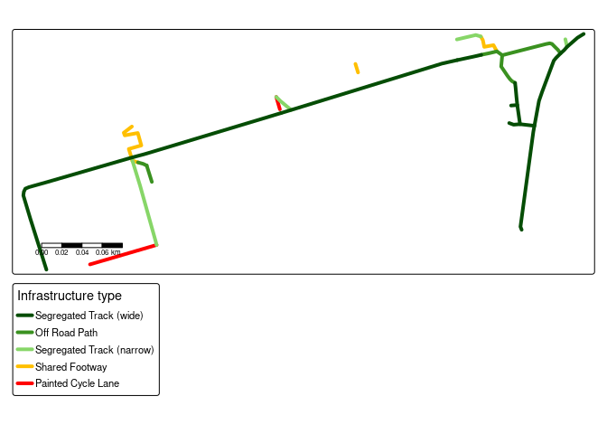
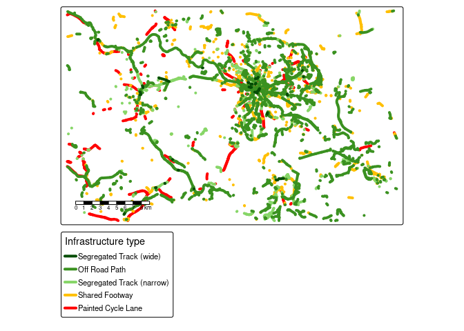

<!-- README.md is generated from README.Rmd. Please edit that file -->

# osmactive

<!-- badges: start -->

[](https://github.com/nptscot/osmactive/actions/workflows/R-CMD-check.yaml)

<!-- badges: end -->

The goal of osmactive is to provide functions, example datasets and
documentation for extracting active travel infrastructure from
OpenStreetMap data.

Install the package with:

``` r
remotes::install_github("nptscot/osmactive")
```

``` r
library(osmactive)
library(tmap) # for mapping
library(dplyr) # for data manipulation
library(sf) # for spatial data
```

Alternatively, you can load the package with the following for local
development:

``` r
devtools::load_all()
```

## Minimal example

The package comes with example data for testing functions. You can test
the functions as follows:

``` r
osm = osm_edinburgh
cycle_net = get_cycling_network(osm)
drive_net = get_driving_network(osm)
drive_net_major = get_driving_network(osm)
cycle_net = distance_to_road(cycle_net, drive_net)
cycle_net = classify_cycle_infrastructure(cycle_net)
table(cycle_net$detailed_segregation)
#> 
#>          Level track Mixed Traffic Street        Off Road Path 
#>                   15                    1                    3 
#>   Painted Cycle Lane 
#>                    2
table(cycle_net$cycle_segregation)
#> 
#>   Segregated Track (wide)             Off Road Path Segregated Track (narrow) 
#>                         7                         4                         4 
#>            Shared Footway        Painted Cycle Lane 
#>                         4                         2
```

You can also create plots with the packaged `plot_osm_tmap()` function:

``` r
m = plot_osm_tmap(cycle_net)
m
```

<!-- -->

Estimate the ‘level of service’ of cycle infrastructure:

``` r
cycle_net_los = level_of_service(cycle_net)
table(cycle_net_los$`Level of Service`)
#> 
#>                                            High 
#>                                              13 
#>                                          Medium 
#>                                               8 
#>                                             Low 
#>                                               0 
#>              Should not be used (mixed traffic) 
#>                                               0 
#> Should not be used (non-compliant intervention) 
#>                                               0
plot(cycle_net_los["Level of Service"])
```

<!-- -->

Use any plotting code you like:

# Running as a shiny app

``` r
shiny::runApp("code/app.R")
```

## Leeds example

``` r
osm = get_travel_network("Leeds")
#> Reading layer `lines' from data source `/data/bronze/osm/bbbike_Leeds.gpkg' using driver `GPKG'
#> Simple feature collection with 175051 features and 67 fields
#> Geometry type: LINESTRING
#> Dimension:     XY
#> Bounding box:  xmin: -1.889999 ymin: 53.65 xmax: -1.280002 ymax: 53.88
#> Geodetic CRS:  WGS 84
cycle_net = get_cycling_network(osm)
drive_net = get_driving_network(osm)
cycle_net_d = distance_to_road(cycle_net, drive_net)
cycle_net_c = classify_cycle_infrastructure(cycle_net_d)
m = plot_osm_tmap(cycle_net_c)
m
```

<!-- -->

## Edinburgh example

``` r
osm = get_travel_network("Edinburgh")
#> Reading layer `lines' from data source `/data/bronze/osm/bbbike_Edinburgh.gpkg' using driver `GPKG'
#> Simple feature collection with 225097 features and 67 fields
#> Geometry type: LINESTRING
#> Dimension:     XY
#> Bounding box:  xmin: -3.579998 ymin: 55.7 xmax: -2.77 ymax: 56.1
#> Geodetic CRS:  WGS 84
cycle_net = get_cycling_network(osm)
drive_net = get_driving_network(osm)
cycle_net = distance_to_road(cycle_net, drive_net)
cycle_net = classify_cycle_infrastructure(cycle_net)
m = plot_osm_tmap(cycle_net)
m
```

<!-- -->

<!-- Save an interactive version of the map to check the resu lts as follows: -->

## Dublin example

``` r
dublin_zones = zonebuilder::zb_zone("Dublin")
dublin_6km = dublin_zones |>
  filter(circle_id <= 3) |>
  sf::st_union()
osm = get_travel_network("Republic of Ireland", boundary = dublin_6km, boundary_type = "clipsrc")
#> 0...10...20...30...40...50...60...70
#> ...80...90...100 - done.
#> Reading layer `lines' from data source 
#>   `/data/bronze/osm/geofabrik_ireland-and-northern-ireland-latest.gpkg' 
#>   using driver `GPKG'
#> Simple feature collection with 57406 features and 67 fields
#> Geometry type: MULTILINESTRING
#> Dimension:     XY
#> Bounding box:  xmin: -6.350653 ymin: 53.29547 xmax: -6.170875 ymax: 53.40329
#> Geodetic CRS:  WGS 84
cycle_net = get_cycling_network(osm)
drive_net = get_driving_network(osm)
cycle_net = distance_to_road(cycle_net, drive_net)
cycle_net = classify_cycle_infrastructure(cycle_net)
m = plot_osm_tmap(cycle_net)
m
```

<!-- -->

## Lisbon example

``` r
u = "https://ushift.tecnico.ulisboa.pt/content/data/lisbon_limit.geojson"
f = basename(u)
if (!file.exists(f)) download.file(u, f)
lisbon = sf::read_sf(f)
lisbon = lisbon |>
  sf::st_cast("POLYGON")
osm = get_travel_network("Portugal", boundary = lisbon, boundary_type = "clipsrc", force_vectortranslate = TRUE)
#> 0...10...20...30...40...50...60...70..
#> .80...90...100 - done.
#> Reading layer `lines' from data source 
#>   `/data/bronze/osm/geofabrik_portugal-latest.gpkg' using driver `GPKG'
#> Simple feature collection with 53724 features and 67 fields
#> Geometry type: MULTILINESTRING
#> Dimension:     XY
#> Bounding box:  xmin: -9.229835 ymin: 38.6914 xmax: -9.087336 ymax: 38.79747
#> Geodetic CRS:  WGS 84
cycle_net = get_cycling_network(osm)
drive_net = get_driving_network(osm)
cycle_net = distance_to_road(cycle_net, drive_net)
cycle_net = classify_cycle_infrastructure(cycle_net)
m = plot_osm_tmap(cycle_net)
m
```

<!-- -->

## London

``` r
london = zonebuilder::zb_zone("Southwark Station", n_circles = 1)
london = sf::st_union(london) |>
  sf::st_make_valid()
osm = get_travel_network(london, boundary = london, boundary_type = "clipsrc")
#> 0...10...20...30...40...50...60...70...80...90..
#> .100 - done.
#> Reading layer `lines' from data source 
#>   `/data/bronze/osm/geofabrik_greater-london-latest.gpkg' using driver `GPKG'
#> Simple feature collection with 6358 features and 67 fields
#> Geometry type: MULTILINESTRING
#> Dimension:     XY
#> Bounding box:  xmin: -0.1189676 ymin: 51.4957 xmax: -0.09016682 ymax: 51.51368
#> Geodetic CRS:  WGS 84
cycle_net = get_cycling_network(osm)
drive_net = get_driving_network(osm)
cycle_net = distance_to_road(cycle_net, drive_net)
cycle_net = classify_cycle_infrastructure(cycle_net)
m = plot_osm_tmap(cycle_net)
m
```

<!-- -->

## Cambridge

``` r
cambridge = zonebuilder::zb_zone("Cambridge")
cambridge = sf::st_union(cambridge) |>
  sf::st_make_valid()
osm = get_travel_network("Cambridge", boundary = cambridge, boundary_type = "clipsrc")
#> 0...10...20...30...40...50...60...70...80...90...100 - done.
#> Reading layer `lines' from data source `/data/bronze/osm/bbbike_Cambridge.gpkg' using driver `GPKG'
#> Simple feature collection with 50436 features and 67 fields
#> Geometry type: MULTILINESTRING
#> Dimension:     XY
#> Bounding box:  xmin: -0.0399984 ymin: 52.12 xmax: 0.319972 ymax: 52.28
#> Geodetic CRS:  WGS 84
cycle_net = get_cycling_network(osm)
drive_net = get_driving_network(osm)
cycle_net = distance_to_road(cycle_net, drive_net)
cycle_net = classify_cycle_infrastructure(cycle_net)
m = plot_osm_tmap(cycle_net)
m
```

<!-- -->

## Bristol example

``` r
osm = get_travel_network("Bristol")
#> Reading layer `lines' from data source 
#>   `/data/bronze/osm/geofabrik_bristol-latest.gpkg' using driver `GPKG'
#> Simple feature collection with 43775 features and 67 fields
#> Geometry type: LINESTRING
#> Dimension:     XY
#> Bounding box:  xmin: -4.926309 ymin: 50.99307 xmax: -2.402599 ymax: 51.73086
#> Geodetic CRS:  WGS 84
cycle_net = get_cycling_network(osm)
drive_net = get_driving_network(osm)
cycle_net = distance_to_road(cycle_net, drive_net)
cycle_net = classify_cycle_infrastructure(cycle_net)
m = plot_osm_tmap(cycle_net)
m
```

<!-- -->

<!-- Save an interactive version of the map to check the resu lts as follows: -->

## Christchurch

``` r
library(sf)
zones = zonebuilder::zb_zone("Christchurch")
zones_6km = zones |>
  dplyr::filter(circle_id <= 3) |>
  sf::st_union()
# mapview::mapview(zones_6km)
osm = get_travel_network("New Zealand", boundary = zones_6km, boundary_type = "clipsrc", force_vectortranslate = TRUE, force_download = TRUE)
#>   |                                                                              |                                                                      |   0%  |                                                                              |                                                                      |   1%  |                                                                              |=                                                                     |   1%  |                                                                              |=                                                                     |   2%  |                                                                              |==                                                                    |   2%  |                                                                              |==                                                                    |   3%  |                                                                              |==                                                                    |   4%  |                                                                              |===                                                                   |   4%  |                                                                              |===                                                                   |   5%  |                                                                              |====                                                                  |   5%  |                                                                              |====                                                                  |   6%  |                                                                              |=====                                                                 |   6%  |                                                                              |=====                                                                 |   7%  |                                                                              |=====                                                                 |   8%  |                                                                              |======                                                                |   8%  |                                                                              |======                                                                |   9%  |                                                                              |=======                                                               |   9%  |                                                                              |=======                                                               |  10%  |                                                                              |=======                                                               |  11%  |                                                                              |========                                                              |  11%  |                                                                              |========                                                              |  12%  |                                                                              |=========                                                             |  12%  |                                                                              |=========                                                             |  13%  |                                                                              |=========                                                             |  14%  |                                                                              |==========                                                            |  14%  |                                                                              |==========                                                            |  15%  |                                                                              |===========                                                           |  15%  |                                                                              |===========                                                           |  16%  |                                                                              |============                                                          |  16%  |                                                                              |============                                                          |  17%  |                                                                              |============                                                          |  18%  |                                                                              |=============                                                         |  18%  |                                                                              |=============                                                         |  19%  |                                                                              |==============                                                        |  19%  |                                                                              |==============                                                        |  20%  |                                                                              |==============                                                        |  21%  |                                                                              |===============                                                       |  21%  |                                                                              |===============                                                       |  22%  |                                                                              |================                                                      |  22%  |                                                                              |================                                                      |  23%  |                                                                              |================                                                      |  24%  |                                                                              |=================                                                     |  24%  |                                                                              |=================                                                     |  25%  |                                                                              |==================                                                    |  25%  |                                                                              |==================                                                    |  26%  |                                                                              |===================                                                   |  26%  |                                                                              |===================                                                   |  27%  |                                                                              |===================                                                   |  28%  |                                                                              |====================                                                  |  28%  |                                                                              |====================                                                  |  29%  |                                                                              |=====================                                                 |  29%  |                                                                              |=====================                                                 |  30%  |                                                                              |=====================                                                 |  31%  |                                                                              |======================                                                |  31%  |                                                                              |======================                                                |  32%  |                                                                              |=======================                                               |  32%  |                                                                              |=======================                                               |  33%  |                                                                              |=======================                                               |  34%  |                                                                              |========================                                              |  34%  |                                                                              |========================                                              |  35%  |                                                                              |=========================                                             |  35%  |                                                                              |=========================                                             |  36%  |                                                                              |==========================                                            |  36%  |                                                                              |==========================                                            |  37%  |                                                                              |==========================                                            |  38%  |                                                                              |===========================                                           |  38%  |                                                                              |===========================                                           |  39%  |                                                                              |============================                                          |  39%  |                                                                              |============================                                          |  40%  |                                                                              |============================                                          |  41%  |                                                                              |=============================                                         |  41%  |                                                                              |=============================                                         |  42%  |                                                                              |==============================                                        |  42%  |                                                                              |==============================                                        |  43%  |                                                                              |==============================                                        |  44%  |                                                                              |===============================                                       |  44%  |                                                                              |===============================                                       |  45%  |                                                                              |================================                                      |  45%  |                                                                              |================================                                      |  46%  |                                                                              |=================================                                     |  46%  |                                                                              |=================================                                     |  47%  |                                                                              |=================================                                     |  48%  |                                                                              |==================================                                    |  48%  |                                                                              |==================================                                    |  49%  |                                                                              |===================================                                   |  49%  |                                                                              |===================================                                   |  50%  |                                                                              |===================================                                   |  51%  |                                                                              |====================================                                  |  51%  |                                                                              |====================================                                  |  52%  |                                                                              |=====================================                                 |  52%  |                                                                              |=====================================                                 |  53%  |                                                                              |=====================================                                 |  54%  |                                                                              |======================================                                |  54%  |                                                                              |======================================                                |  55%  |                                                                              |=======================================                               |  55%  |                                                                              |=======================================                               |  56%  |                                                                              |========================================                              |  56%  |                                                                              |========================================                              |  57%  |                                                                              |========================================                              |  58%  |                                                                              |=========================================                             |  58%  |                                                                              |=========================================                             |  59%  |                                                                              |==========================================                            |  59%  |                                                                              |==========================================                            |  60%  |                                                                              |==========================================                            |  61%  |                                                                              |===========================================                           |  61%  |                                                                              |===========================================                           |  62%  |                                                                              |============================================                          |  62%  |                                                                              |============================================                          |  63%  |                                                                              |============================================                          |  64%  |                                                                              |=============================================                         |  64%  |                                                                              |=============================================                         |  65%  |                                                                              |==============================================                        |  65%  |                                                                              |==============================================                        |  66%  |                                                                              |===============================================                       |  66%  |                                                                              |===============================================                       |  67%  |                                                                              |===============================================                       |  68%  |                                                                              |================================================                      |  68%  |                                                                              |================================================                      |  69%  |                                                                              |=================================================                     |  69%  |                                                                              |=================================================                     |  70%  |                                                                              |=================================================                     |  71%  |                                                                              |==================================================                    |  71%  |                                                                              |==================================================                    |  72%  |                                                                              |===================================================                   |  72%  |                                                                              |===================================================                   |  73%  |                                                                              |===================================================                   |  74%  |                                                                              |====================================================                  |  74%  |                                                                              |====================================================                  |  75%  |                                                                              |=====================================================                 |  75%  |                                                                              |=====================================================                 |  76%  |                                                                              |======================================================                |  76%  |                                                                              |======================================================                |  77%  |                                                                              |======================================================                |  78%  |                                                                              |=======================================================               |  78%  |                                                                              |=======================================================               |  79%  |                                                                              |========================================================              |  79%  |                                                                              |========================================================              |  80%  |                                                                              |========================================================              |  81%  |                                                                              |=========================================================             |  81%  |                                                                              |=========================================================             |  82%  |                                                                              |==========================================================            |  82%  |                                                                              |==========================================================            |  83%  |                                                                              |==========================================================            |  84%  |                                                                              |===========================================================           |  84%  |                                                                              |===========================================================           |  85%  |                                                                              |============================================================          |  85%  |                                                                              |============================================================          |  86%  |                                                                              |=============================================================         |  86%  |                                                                              |=============================================================         |  87%  |                                                                              |=============================================================         |  88%  |                                                                              |==============================================================        |  88%  |                                                                              |==============================================================        |  89%  |                                                                              |===============================================================       |  89%  |                                                                              |===============================================================       |  90%  |                                                                              |===============================================================       |  91%  |                                                                              |================================================================      |  91%  |                                                                              |================================================================      |  92%  |                                                                              |=================================================================     |  92%  |                                                                              |=================================================================     |  93%  |                                                                              |=================================================================     |  94%  |                                                                              |==================================================================    |  94%  |                                                                              |==================================================================    |  95%  |                                                                              |===================================================================   |  95%  |                                                                              |===================================================================   |  96%  |                                                                              |====================================================================  |  96%  |                                                                              |====================================================================  |  97%  |                                                                              |====================================================================  |  98%  |                                                                              |===================================================================== |  98%  |                                                                              |===================================================================== |  99%  |                                                                              |======================================================================|  99%  |                                                                              |======================================================================| 100%
#> 0...10...20...30...40...50...60...70...80
#> ...90...100 - done.
#> Reading layer `lines' from data source 
#>   `/data/bronze/osm/geofabrik_new-zealand-latest.gpkg' using driver `GPKG'
#> Simple feature collection with 52558 features and 67 fields
#> Geometry type: MULTILINESTRING
#> Dimension:     XY
#> Bounding box:  xmin: 172.5622 ymin: -43.58494 xmax: 172.7107 ymax: -43.47698
#> Geodetic CRS:  WGS 84
# osm = get_travel_network("New Zealand")
# osm = osm[zones_6km, , op = sf::st_within]
dim(osm)
#> [1] 52558    69
cycle_net = get_cycling_network(osm)
drive_net = get_driving_network(osm)
cycle_net = distance_to_road(cycle_net, drive_net)
cycle_net = classify_cycle_infrastructure(cycle_net)
summary(cycle_net$cycle_segregation)
#>   Segregated Track (wide)             Off Road Path Segregated Track (narrow) 
#>                         8                       915                       526 
#>            Shared Footway        Painted Cycle Lane 
#>                      1395                      1605
plot(cycle_net)
```

<!-- -->

``` r
m = plot_osm_tmap(cycle_net)
m
```

<!-- -->
