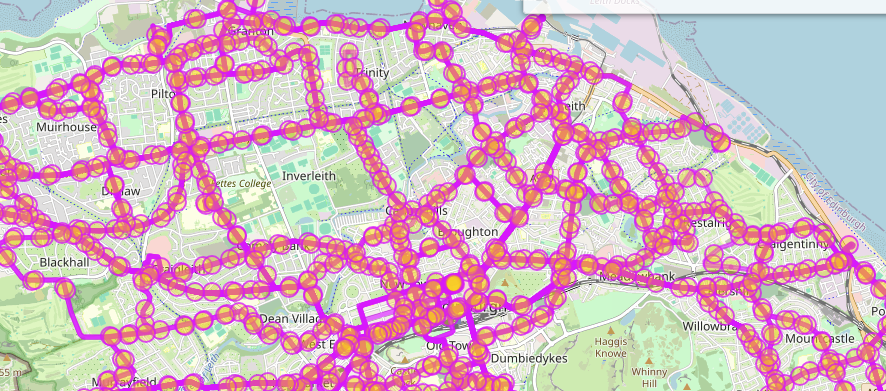
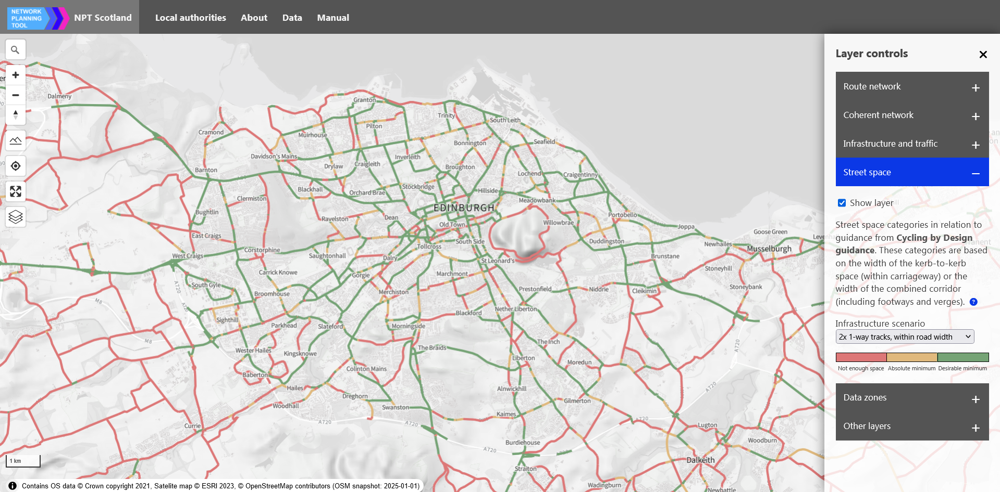

Robin Lovelace, Zhao Wang, Hussein Mahfouz, Juan Jose Fonseca
Zamora, Martin Lucas-Smith, Dustin Carlino, Josiah Parry

<!-- Workaround for bug in gfm rendering of titles by quarto: -->

# Mapping, classifying, and integrating diverse street network datasets: new methods and open source tools for active travel planning

<!-- # Spec: blog post to publish on Ordnance Survey's website outlining how we have used their products to improve strategic cycle network planning in Scotland -->

<!-- # Background
&#10;From the manual at https://github.com/nptscot/nptscot.github.io/blob/dev/manual/index.md?plain=1:
&#10;Welcome to the Network Planning Tool (NPT) for Scotland, a cutting-edge web application designed for strategic cycle network planning. Funded by Transport Scotland and developed by the University of Leeds in collaboration with Sustrans Scotland. It builds on the functionality of the [Propensity to Cycle Tool](https://www.pct.bike/) for England and Wales, offering a detailed nationwide cycling potential analysis for Scotland, down to the street level ([Lovelace et al. 2017](https://www.jtlu.org/index.php/jtlu/article/view/862)). We invite users to explore its comprehensive features and contribute feedback for continuous improvement.
&#10;### NPT overview
&#10;The NPT is Scotland’s nationwide web-based strategic network planning tool that estimates cycling potential down to the street level.
&#10;The easiest way to access the NPT website is hosted at [www.npt.scot](http://www.npt.scot).
&#10;The NPT includes:
&#10;1.  the [map user interface](https://www.npt.scot/), 
2.  a series of open access [data downloads](https://www.npt.scot/data) that can be analysed in GIS software or statistical software, 
3.  the [code base](https://github.com/nptscot/) that can be modified to fix bugs, add new features, and develop new scenarios.
&#10;The NPT is an open-source tool, meaning the source code is transparent and in the public domain for others to learn from and build on. The code underlying the project is available to be copied and improved by the community.
&#10;The online interface can serve many needs, including gaining insight into the network of routes where cycling potential is highest and quantifying the benefits of cycling uptake. However, we recommend that intermediate and advanced users download data on zones, routes and route networks for in-house analysis.
&#10;The NPT allows users to visualise results baseline data and how cycling would change under different scenarios. The journey purposes and scenarios are described in detail below.
&#10;## NPT user interface guide
&#10;The NPT's user interface is intuitive, featuring map controls for easy navigation and layer controls to customize data visibility. Whether you're interested in the baseline cycling data or exploring various "what-if" scenarios like "Go Dutch" or ebike adoption, the tool provides a flexible platform for in-depth analysis.
&#10;... 
&#10;
### Street space -->

<!-- From index.html:
&#10;                
Street width category in relation to guidance from the Cycling by Design (CbD) guidance.<button aria-label="Help on cycle infrastructure types info" class="helpbutton" data-help="streetspace"><i class="fa fa-question-circle" aria-hidden="true"></i></button>
  
                

                    

                        

                            
Not enough space

                            
Enough space (absolute minimum)

                            
Enough space (minimum)

                            
Plenty of space

                        

                    

                

&#10;-->

<!-- The Street Space layer categorises roads in accordance with the [Cycling by Design guidance](https://www.transport.gov.scot/media/50323/cycling-by-design-update-2019-final-document-15-september-2021-1.pdf#page=68). It specifies the methodology for classifying road spaces and cycle infrastructure. The sections below describe the measurement methods for roads, the cycle infrastructure types considered, and the assumptions regarding bus routes and road types.
&#10;#### Road width measurements
&#10;Two key measurements are taken to assess whether existing roads can accommodate cycle infrastructure:
&#10;##### Carriageway width 
   &#10;- **Definition:** The width available within the carriageway only.
- **Excludes:** Manmade roadside area such as footways.
- **Usage:** Determines if cycle infrastructure can fit solely within the carriageway.
&#10;##### Corridor width (Edge to edge)
&#10;- **Definition:** The total width of the corridor, encompassing both the carriageway and manmade roadside features (e.g., pavements). 
- **Usage:** Where local policy allows, part of the footway or other manmade roadside features may be reallocated for cycle infrastructure, provided that minimum safe footway widths are maintained.
&#10;#### Cycle infrastructure width requirements
&#10;Two main types of cycle infrastructure are considered, depending on the street configuration:
&#10;Unidirectional Cycle Tracks (2 × 1-Way Protected Cycle Tracks):
  - *Absolute Minimum Width:* 1.5 m  
  - *Desirable Minimum Width:* 2.0 m  
&#10;Bidirectional Cycle Tracks (1 × 2-Way Protected Cycle Track):
  - *Absolute Minimum Width:* 2.0 m
  - *Desirable Minimum Width:* 3.0 m
&#10;#### Buffers for cycle infrastructure
&#10;Buffers are applied based on road speed and traffic conditions, as specified in Table 3.8 of the Cycling by Design document. These buffers must be accounted for when calculating the effective available width for cycle infrastructure.
&#10;
#### Bus routes and road traffic assumptions
&#10;##### Bus routes and dedicated bus lanes
&#10;Bus routes and dedicated bus lanes are key factors in determining the available space for cycle infrastructure:
&#10;- **Non-bus routes:**  
  The motor traffic space is considered as **2 × 2.75 m**.
&#10;- **Bus routes without dedicated bus lanes:**  
  The motor traffic space is considered as **2 × 3.2 m**.
&#10;- **Bus routes with dedicated bus lanes:**  
  The motor traffic space is considered as **2 × 3.2 m** plus an additional space of **`n_bus_lanes` × 3.2 m** for the dedicated bus lanes.
&#10;##### Road types
&#10;Roads are categorised based on their traffic configuration and bus route status:
- Two‐way for motor traffic (non–bus route)
- Two‐way for motor traffic (bus route without dedicated bus lanes)
- Two‐way for motor traffic (bus route with dedicated bus lanes)
&#10;#### Categorisation based on available width
&#10;The Street Space layer divides roads into three groups, depending on whether the available width (carriageway width or corridor width) can accommodate the cycle infrastructure:
&#10;- **Not enough space:**
  The available space is insufficient to fit even the absolute minimum width of cycle infrastructure.
&#10;- **Absolute minimum:**
  The available space is enough to accommodate the absolute minimum width of cycle infrastructure, but it does not meet the desirable minimum.
&#10;- **Desirable minimum:**
  The available space is sufficient to accommodate the desirable minimum width of cycle infrastructure, providing a more comfortable design for all users. -->

# Introduction

Active travel is an accessible and cost-effective way to replace short
car trips and make transport systems more sustainable. The Network
Planning Tool (NPT) for Scotland is a new web-based strategic network
planning tool that estimates cycling potential down to the street level.
The NPT builds on the functionality of the Propensity to Cycle Tool
(PCT) and related tools \[Lovelace et al. (2017)\](Goodman et al.
2019)\[Lovelace et al. (2024)\](Félix, Moura, and Lovelace 2025),
offering a detailed nationwide cycling potential analysis for Scotland.
The NPT is funded by Transport Scotland and developed by the University
of Leeds in collaboration with Sustrans Scotland. The tool is
open-source and hosted at
[github.come/nptscot](https://github.com/nptscot), enabling others to
learn from and contribute.

A unique feature of the NPT is its integration of multiple layers into a
single tool, overcoming limitations of previous strategic network
planning tools, which generally focus either on behaviour data (such as
the PCT) or physical infrastructure (Vybornova et al. 2024; Vierø,
Vybornova, and Szell 2024). The NPT brings together more than a dozen
datasets, including Ordnance Survey Mastermap and OpenStreetmap data
products to provide comprehensive data on the potential for mode shift,
infrastructure, modelled motor traffic levels, and street space at the
network level. This paper presents new geographic methods we developed
to support this work, with reference to reproducible code that use the
new `osmactive` R package for classifying national-scale OpenStreetMap
(OSM) datasets based on attributes and geographic relationships, and the
`anime` Rust crate for astonishingly fast and accurate route network
data integration.

# Datasets and methods

The NPT uses datasets from diverse sources including from the DfT’s
network of traffic sensors, motor traffic counts based a survey
evaluating Edinburgh’s roll-out of 20 mph speed limits, the National
Travel Survey, and the Scottish Household Travel Survey. We used four
key datasets representing the road network for this project:

- Ordnance Survey OpenRoads, an open access and simplified
  representation of the road network that is ideal for visualisation
- OS MasterMap Highways, a more detailed dataset that includes
  information on road widths and other features
- OS Mastermap Topography, the most detailed vector dataset that
  includes detailed information on the geometry of many features of the
  man-made environment, including curb lines. In the OS Topo layer roads
  and other pieces of transport infrastructure such as footways
  (pavements) are represented not as corridor or lane centerlines, but
  as polygons.
- OpenStreetMap, a crowdsourced dataset that is continuously updated by
  community volunteers. The dataset is rich, with tags for width and
  smoothness of infrastructure, but is not as consistent as the OS
  datasets.

Ordnance Survey’s MasterMap Highways and Topography datasets provide
unparalleled accuracy and detail, ensuring reliable measurements for
road widths and corridor spaces. This level of precision is critical for
planning safe and effective cycling infrastructure.

In terms of methods, we collaborated with ESRI researcher Josiah Parry
who developed a new algorithm to efficiently join the networks, based on
alignment and proximity.
<!-- Partial matches are represented by source and target weights for each matching pair of linestrings. -->
<!-- Technical version: -->
<!-- The use of spatial indexes makes the implementation highly efficient compared with the [`rnet_join()`](https://docs.ropensci.org/stplanr/reference/rnet_join.html) function in the R package `stplanr` that we were using previously. -->
<!-- Simple version: --> The use of spatial indexes makes the
implementation highly efficient compared with the [R
implementation](https://docs.ropensci.org/stplanr/reference/rnet_join.html)
that we were using previously. See the [josiahparry/ANIME codebase on
GitHub](https://github.com/JosiahParry/anime) for details of the new
algorithm and its implementation as an R (and planned Python) interface
to the new [`anime` Rust crate](https://crates.io/crates/anime).

# Road width measurements

Two key measurements are needed to assess whether existing roads can
accommodate cycle infrastructure: carriageway width and corridor width,
as defined below.

## Carriageway width

The carriageway width is the width available within the carriageway,
often referred to as the “curb-to-curb” width, excluding roadside
features such as footways. Fortunately, Ordnance Survey MasterMap
Highways provides this data nationally to public sector organisations
under the Public Sector Geospatial Agreement (PSGA).

Accurate and available carriageway width measurements are important
because they determine if proposed infrastructure can fit solely within
the carriageway, without the need for moving curbs or other roadside
features. As outlined in the Scottish Cycling by Design (CbD) guidance
document, there are three main types of cycle infrastructure that run
along (or “adjacent to” as the CbD guidance puts it) the carriageway:

- Cycle track at carriageway level
- Stepped cycle track
- Cycle track at footway level

The first two options are recommended, reducing the potential for
conflict between cyclists and pedestrians. The first option, cycle track
that is at carriage level, has additional advantages over stepped
cycleway, being often cheaper to construct, with no new tarmac required
in many cases, and with advantages for users outlined in the following
[quote from the CbD
guidance](https://www.transport.gov.scot/media/50323/cycling-by-design-update-2019-final-document-15-september-2021-1.pdf#page=76):

> Cycle tracks at carriageway level will often be preferred where a new
> cycle track is to be formed from space previously given to the road
> carriageway, and where it is not practical or desirable to form a
> stepped cycle track. They enable the existing carriageway crossfall to
> be maintained, which can be beneficial for drainage purposes. Where
> this is the case, regular gaps in the kerbed reserve are required to
> ensure continuity of surface water flow. Cycle tracks at carriageway
> level are particularly appropriate where there are multiple side roads
> or minor accesses along the route, simplifying crossings without
> requiring level changes for the cycle user.

However, cycle tracks at carriageway level require sufficient width on
the existing carriageway to accommodate the cycle infrastructure. How
can local authority transport planners and other stakeholders know if
there is enough space on the carriageway to accommodate cycle
infrastructure? This is an important question that has implications for
the design and potential costs of new cycling infrastructure. The CbD
guidance is clear on how much width is required, but it can be time
consuming to interpret this guidance for every road in a local authority
area, hence the street space layer in the NPT.

## Corridor width

<!-- Query to get pavements: filter(descriptive_group == "Roadside", make == "Manmade") -->

We define the corridor width as the width of the carrieageway plus any
built roadside features, such as footways. Given Ordnance Survey’s
MasterMap Topography dataset contains this data, in the form of polygons
representing roadside features that are “manmade”. Specifically, the
following [`dplyr` query](https://dplyr.tidyverse.org/) was used to
extract the width of manmade roadside features:
`filter(descriptive_group == "Roadside", make == "Manmade")`. From that
point, we calculated the width of pavements associated with each road
segment by dividing the area of matching polygons associated with each
road segment by the length of the road segment.

The corridor width is important because it determines whether, in cases
where there is insufficient space on the carriageway, part of the
footway or other manmade roadside features may be reallocated for cycle
infrastructure, while still maintaining recommended minimum widths for
pedestrians.

# Cycle infrastructure width requirements

The CbD guidance specifies the minimum width required for cycle
infrastructure, which is summarised in the table below:

| Cycle infrastructure type  | Absolute minimum width | Desirable minimum width |
|----------------------------|------------------------|-------------------------|
| Unidirectional cycle track | 1.5 m                  | 2.0 m                   |
| Bidirectional cycle track  | 2.0 m                  | 3.0 m                   |

As the table shows, the desirable minimum width is greater than the
absolute minimum width, providing a more comfortable design for all
users. Although the width requirements for a single unidirectional cycle
track are less than for a bidirectional cycle track, the latter has the
advantage of requiring less space overall, as it only requires one
track, rather than two.

In most cases, two unidirectional cycle tracks represent the best design
from a safety perspective, as they reduce the need for cyclists to cross
the road (cyclists on a unidirectional track can always turn left at a
junction without crossing the road, while those on a bidirectional track
must cross the road to turn left half the time, depending on which side
of the road the bidirectional track is on). Unidirectional cycle tracks
also reduce the potential for cyclist-cyclist collisions: separating
vehicles that may be moving at 20 km in opposite directions is common
sense, especially along corridors with high cycling potential where the
volume of cyclists is likely to lead to overtaking.

One could assume that the table above plus information on road widths
provides everything you need to find out if there is enough space for
cycle infrastructure on a given road. However, the CbD guidance also
specifies buffers, the recommended width of which depends on the speed
of motor traffic on the road.

# Buffers for cycle infrastructure

The CbD guidance specifies buffers that must be accounted for when
calculating the effective available width for cycle infrastructure.

| Road type / Speed limit | Buffer width |
|-------------------------|--------------|
| 30 mph                  | 0.5 m        |
| 40 mph                  | 1.0 m        |
| 50 mph                  | 2.0 m        |
| 60 mph                  | 2.5 m        |
| 70 mph                  | 3.5 m        |

Speed limit data taken from OSM was used to determine the buffer width
for each road segment.

# Bus routes and road traffic assumptions

The minimum space requirements for motor traffic depend on the uses of
the road, including whether it is a bus route and whether there are
dedicated bus lanes. Based on the Active Travel England cross section
check tool, part of [Active Travel England’s open access Excel-based
design
tools](https://www.gov.uk/government/publications/active-travel-england-design-assistance-tools)
(see
[acteng.github.io/inspectorate_tools/](https://acteng.github.io/inspectorate_tools/)
for web-based versions), we assumed the following widths for motor
traffic:

- Non-bus routes: 2 × 2.75 m
- Bus routes without dedicated bus lanes: 2 × 3.2 m
- Bus routes with dedicated bus lanes: 2 × 3.2 m plus an additional
  space of `n_bus_lanes` × 3.2 m for the dedicated bus lanes.

<!-- https://overpass-turbo.eu/s/1Xaf -->

The number of bus lanes was determined from the OSM data with the
function
[`get_bus_routes()`](https://nptscot.github.io/osmactive/reference/get_bus_routes.html)
in the R package `osmactive` that we developed for this project. The
results are illustrated in the figure below for Edinburgh, which can
also be extracted with the following [Overpass Turbo
query](https://overpass-turbo.eu/s/1Xaf):

    relation["route"="bus"]({{bbox}});

<!--  -->

<!-- wget https://private-user-images.githubusercontent.com/1825120/403049322-97f3ce0e-7d0f-42ab-b2d5-e7557c4ebece.png?jwt=eyJhbGciOiJIUzI1NiIsInR5cCI6IkpXVCJ9.eyJpc3MiOiJnaXRodWIuY29tIiwiYXVkIjoicmF3LmdpdGh1YnVzZXJjb250ZW50LmNvbSIsImtleSI6ImtleTUiLCJleHAiOjE3Mzc5OTg1NDcsIm5iZiI6MTczNzk5ODI0NywicGF0aCI6Ii8xODI1MTIwLzQwMzA0OTMyMi05N2YzY2UwZS03ZDBmLTQyYWItYjJkNS1lNzU1N2M0ZWJlY2UucG5nP1gtQW16LUFsZ29yaXRobT1BV1M0LUhNQUMtU0hBMjU2JlgtQW16LUNyZWRlbnRpYWw9QUtJQVZDT0RZTFNBNTNQUUs0WkElMkYyMDI1MDEyNyUyRnVzLWVhc3QtMSUyRnMzJTJGYXdzNF9yZXF1ZXN0JlgtQW16LURhdGU9MjAyNTAxMjdUMTcxNzI3WiZYLUFtei1FeHBpcmVzPTMwMCZYLUFtei1TaWduYXR1cmU9OGRlODM0ODhkYTkzNDUyMzcxYWZkMzFlY2M4Yjk3YmE3ODQzMTU0ZGM0MjVmMTU5ZGU5MzBlMzVhZDM3Y2MyNSZYLUFtei1TaWduZWRIZWFkZXJzPWhvc3QifQ.seGt2frqknDrrU5Y6pgptC24sgXGhn06pQ3t-diXmLA -O edinburgh_bus_lanes.png -->

*Figure 1 Bus routes in Edinburgh, extracted from OpenStreetMap.*

# Categorisation based on available width

As with many data science tasks, the pre-processing stage is the most
time-consuming. After calculating the carriageway and corridor widths,
plus key information on the minimum buffer width requirements and motor
traffic space, we categorised roads into three groups based on the
available width:

- Not enough space: The available space is insufficient to fit even the
  absolute minimum width of cycle infrastructure.
- Absolute minimum: The available space is enough to accommodate the
  absolute minimum width of cycle infrastructure, but it does not meet
  the desirable minimum.
- Desirable minimum: The available space is sufficient to accommodate
  the desirable minimum width of cycle infrastructure, providing a more
  comfortable design for all users.

This three-way categorisation was made for each of the following
scenarios:

- 2x unidirectional cycle tracks built on the carriageway
- 2x unidirectional cycle tracks built on the corridor
- 1x bidirectional cycle track built on the carriageway
- 1x bidirectional cycle track built on the corridor

The results are illustrated below.

# Conclusion

The Street Space layer in the NPT offers unprecedented insights into
Scotland’s road network for strategic active travel network planning. By
highlighting where there is enough space for different safe cycling
infrastructure options, the tool can help local authorities and other
stakeholders make more informed decisions about where to invest in
cycling infrastructure. This is the first time such detailed, nationwide
information on street space has been made available in Scotland.

*Figure 2 Street Space layer in Network Planning Tool for Scotland.*

This is the first time that such detailed information on road widths has
been made available for active travel planning nationwide in Scotland.
We hope to improve the NPT’s street space layer in the future for
example by incorporating on-street parking data from [Scotland’s Spatial
Hub](https://data.spatialhub.scot). The resulting evidence will help
local authorities and other stakeholders to make more informed decisions
about where to invest in cycling infrastructure, and to make the case
for reallocating road space to active travel.

To explore the Network Planning Tool for Scotland and discover how the
Street Space layer can inform cycling infrastructure projects local
areas you know in Scotland visit: https://www.npt.scot/#/streetspace/.

Félix, Rosa, Filipe Moura, and Robin Lovelace. 2025. “Reproducible
Methods for Modeling Combined Public Transport and Cycling Trips and
Associated Benefits: Evidence from the biclaR Tool.” *Computers,
Environment and Urban Systems* 117 (April): 102230.
<https://doi.org/10.1016/j.compenvurbsys.2024.102230>.

Goodman, Anna, Ilan Fridman Rojas, James Woodcock, Rachel Aldred,
Nikolai Berkoff, Malcolm Morgan, Ali Abbas, and Robin Lovelace. 2019.
“Scenarios of Cycling to School in England, and Associated Health and
Carbon Impacts: Application of the ‘Propensity to Cycle Tool’.” *Journal
of Transport & Health* 12 (March): 263–78.
<https://doi.org/10.1016/j.jth.2019.01.008>.

Lovelace, Robin, Anna Goodman, Rachel Aldred, Nikolai Berkoff, Ali
Abbas, and James Woodcock. 2017. “The Propensity to Cycle Tool: An Open
Source Online System for Sustainable Transport Planning.” *Journal of
Transport and Land Use* 10 (1). <https://doi.org/10.5198/jtlu.2016.862>.

Lovelace, Robin, Joey Talbot, Eugeni Vidal-Tortosa, Hussein Mahfouz,
Elaine Brick, Peter Wright, Gary O’Toole, Dan Brennan, and Suzanne
Meade. 2024. “Cycle Route Uptake and Scenario Estimation (CRUSE): An
Approach for Developing Strategic Cycle Network Planning Tools.”
*European Transport Research Review* 16 (1): 55.
<https://doi.org/10.1186/s12544-024-00668-8>.

Vierø, Ane Rahbek, Anastassia Vybornova, and Michael Szell. 2024.
“BikeDNA: A Tool for Bicycle Infrastructure Data and Network
Assessment.” *Environment and Planning B: Urban Analytics and City
Science* 51 (2): 512–28. <https://doi.org/10.1177/23998083231184471>.

Vybornova, Anastassia, Ane Rahbek Vierø, Kirsten Krogh Hansen, and
Michael Szell. 2024. “BikeNodePlanner: A Data-Driven Decision Support
Tool for Bicycle Node Network Planning,” December.
<https://doi.org/10.48550/arXiv.2412.20270>.

